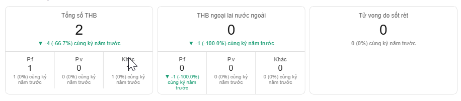
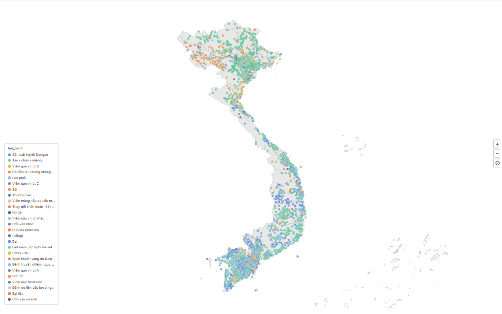
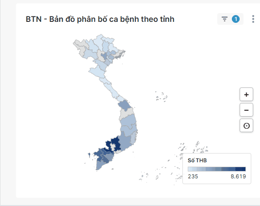

# ECDS Superset Plugins

Custom Apache Superset chart plugins built for the ECDS Vietnam project. Three production plugins are available in this repository.

---

## Plugins

### 1. ECDS HTML Widget

**Package:** `superset-plugin-chart-ecds-html-widget`
**Chart key:** `ecds_html_widget`
**Location:** [ecds-html-widget/](ecds-html-widget/)

Embed custom HTML and JavaScript directly into a Superset dashboard, with full access to the chart's dataset at runtime.

**Capabilities:**
- Write any HTML/CSS/JS — rendered inside a sandboxed iframe
- Bind dataset values into the template using `{{column_name}}` placeholders
- Access all rows via the `window.__chartData` global variable, enabling custom D3, Chart.js, or plain JS visualizations
- Automatic iframe height adjustment to match content
- Screenshot and PDF export via html2canvas (canvas rendering mode)
- Locale-aware number formatting (Vietnamese locale)

**Typical uses:** custom KPI cards, narrative reports, tables with conditional formatting, any visualization not covered by built-in chart types.



---

### 2. ECDS Point Map

**Package:** `superset-plugin-chart-ecds-point-map`
**Chart key:** `ecds_point_map`
**Location:** [ecds-point-map/](ecds-point-map/)

Plot dataset rows as geographic points on a map using latitude and longitude columns, with support for bubble or pie chart styling at each location.

**Capabilities:**
- Render **bubble markers** sized by a metric value
- Render **pie chart markers** segmented by a group-by column
- Consistent bubble scaling across time periods
- **Timelapse animation** — step through time periods and watch the map update
- Drilldown by region ID (province / commune)
- Geographic filtering with province and commune support
- Configurable map background layer via a secondary dataset

**Typical uses:** facility-level indicators, outbreak mapping, coverage rates by health post.



---

### 3. ECDS Region Map

**Package:** `superset-plugin-chart-ecds-region-map`
**Chart key:** `ecds_region_map`
**Location:** [ecds-region-map/](ecds-region-map/)

Choropleth map where region boundaries are loaded from a dataset in GeoJSON format. Regions are color-filled based on a metric value, with hierarchical drilldown support.

**Capabilities:**
- Color-filled (choropleth) regions using a configurable linear color scheme
- Region boundaries loaded from a **dataset in GeoJSON format** — not limited to Vietnamese administrative divisions; any custom boundary (health zones, project areas, etc.) works as long as the dataset provides valid GeoJSON
- **Hierarchical drilldown** — click a region to zoom into sub-regions; breadcrumb navigation back up
- Two-datasource architecture: one dataset for metric data, one for boundary GeoJSON and administrative structure via REST API
- **7 filtering scenarios** supporting different combinations of province and commune dashboard filters
- Auto-drill logic that responds to filter selections automatically
- **Timelapse animation** — step through time and watch the choropleth update
- Guest token support for embedded dashboards

**Typical uses:** national/provincial health indicator comparisons, coverage maps, district-level performance dashboards.



---

### 4. ECDS Data Table

**Package:** `superset-plugin-chart-ecds-data-table`
**Chart key:** `ecds_data_table`
**Location:** [ecds-data-table/](ecds-data-table/)

Bảng số liệu tương tác với filter, sort, heatmap tô màu và export Excel.

**Capabilities:**
- **Hai chế độ query:** Aggregate (groupby + metrics) và Raw records (toàn bộ dòng, chọn cột tùy ý)
- **Filter** inline tại mỗi cột — nhập text lọc ngay dưới header, cột đang lọc highlight viền xanh
- **Sort** click header — toggle tăng/giảm, indicator ▲▼; sort số đúng thứ tự numeric, sort text theo locale `vi`
- **Heatmap** 3 phạm vi: theo cột / theo hàng / toàn bảng; màu low/high tùy chỉnh qua ColorPicker
- **Pagination** tắt được (hiển thị tất cả) hoặc 20/50/100/200 dòng/trang
- **Tùy chỉnh màu sắc bảng:** nền header, chữ header, hàng lẻ/chẵn, màu viền — tất cả qua ColorPickerControl
- **Datetime columns** tự động format đúng (không hiển thị epoch milliseconds)
- **Export Excel** — nút ⬇ Excel trong footer, export toàn bộ dòng đang filter/sort (không giới hạn trang)
- Số tự căn phải + format locale `vi-VN`; cột text căn trái
- Footer badge hiển thị chế độ query, tổng số dòng, số dòng sau khi lọc

**Typical uses:** bảng báo cáo dịch bệnh theo tỉnh/huyện, so sánh chỉ số nhiều chiều, xuất dữ liệu có điều kiện màu ra Excel.

---

## Repository structure

```
ecds-html-widget/     HTML/JS widget plugin
ecds-point-map/       Geographic point/bubble map plugin
ecds-region-map/      Choropleth region map plugin (with GeoJSON)
ecds-data-table/      Data table plugin với filter, sort và heatmap
plugin/               Starter scaffold (Hello World template)
```

## Development

Each plugin is an independent npm package. From any plugin directory:

```bash
npm install
npm run build   # production build
npm run dev     # watch mode
```

**Requirements:** Node.js 20.x, npm 10.x

## Linking a plugin into a local Superset checkout

From the `superset-frontend` directory in your Superset source tree:

```bash
npm install --save ../../<plugin-directory>
```

Then register the plugin in `superset-frontend/src/visualizations/presets/MainPreset.js`:

```js
import { EcdsRegionMapPlugin } from 'superset-plugin-chart-ecds-region-map';
// repeat for other plugins
```

```js
new EcdsRegionMapPlugin().configure({ key: 'ecds_region_map' }),
```
